# **AI Model Marketplace**

## **Description**
`AI Model Marketplace` is a decentralized application (dApp) that allows users to:
- List AI models for sale.
- Purchase AI models securely.
- Rate purchased AI models.
- Retrieve details of listed models.
- Withdraw funds from model sales.

This project demonstrates smart contract development, frontend integration with Web3.js, and deployment to the Ethereum Holesky Testnet.

---

## **Features**
1. **List Model**: Add AI models to the marketplace.
2. **Purchase Model**: Securely purchase models using ETH.
3. **Rate Model**: Rate models after purchase.
4. **Get Model Details**: Retrieve the name, description, price, creator, and average rating.
5. **Withdraw Funds**: Model creators can withdraw funds from sales.

---

## **Project Structure**

```plaintext
AI-Model-Marketplace/
├── contracts/               # Smart contracts
│   └── AIModelMarketplace.sol   # Core contract logic
├── frontend/                # Frontend code
│   ├── index.html           # HTML structure
│   ├── app.js               # JavaScript logic for interacting with the smart contract
│   └── style.css            # Optional styles
├── artifacts/               # Compiled contract artifacts (from Hardhat)
├── README.md                # Documentation
├── LICENSE                  # Project license
├── package.json             # Node.js configuration
└── hardhat.config.js        # Hardhat configuration
```

---

## **Installation**

### **1. Prerequisites**
- [Node.js](https://nodejs.org/) and npm installed.
- [MetaMask](https://metamask.io/) browser extension installed.
- Holesky Testnet ETH (obtain from [Sepolia/Holesky Faucet](https://faucets.chain.link/sepolia)).

### **2. Clone the Repository**
```bash
git clone https://github.com/YOUR_USERNAME/AI-Model-Marketplace.git
cd AI-Model-Marketplace
```

### **3. Install Dependencies**
```bash
npm install
```

### **4. Compile Smart Contracts**
Compile the smart contracts using Hardhat:
```bash
npx hardhat compile
```

### **5. Deploy the Contract**
Deploy your contract to the Holesky Testnet:
```bash
npx hardhat run scripts/deploy.js --network holesky
```

- **Hardhat Deployment Output**:
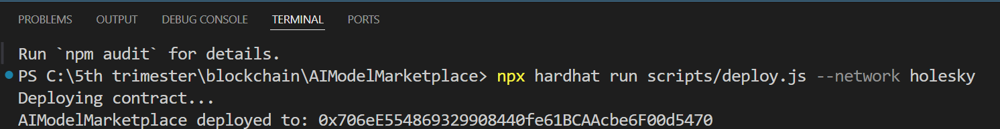


---


#### **Using Ganache for Local Development**

Ganache is used for local Ethereum blockchain testing. Follow these steps to set it up:

---

### **1. Install Ganache**
1. Download Ganache from [here](https://trufflesuite.com/ganache/).
2. Install it on your system.

---

### **2. Start the Ganache Network**
1. Open Ganache.
2. Create a new workspace (or use the default one).
3. Ensure the RPC server is running at `http://127.0.0.1:7545`.

**Screenshot**:  
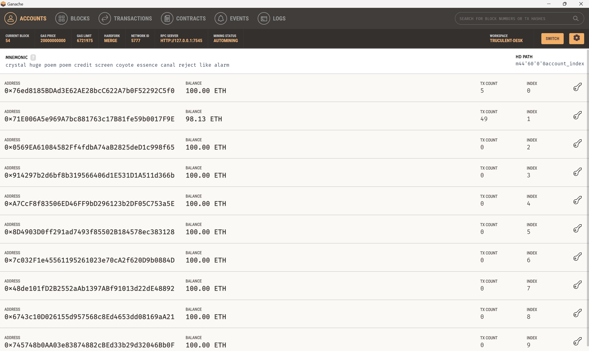

### **3. Configure Hardhat to Connect with Ganache**
Modify the `hardhat.config.js` file to include a Ganache network:

```javascript
module.exports = {
  networks: {
    ganache: {
      url: "http://127.0.0.1:7545",
      accounts: ["YOUR_PRIVATE_KEYS_FROM_GANACHE"], // Replace with private keys
    },
  },
  solidity: "0.8.0",
};
```

**Screenshot**:  
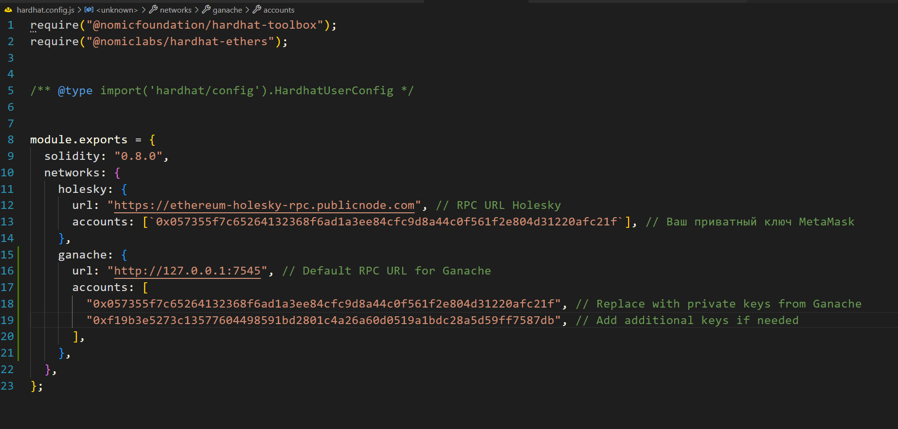
---

### **4. Deploy Contract to Ganache**
Deploy the contract to the Ganache network:
```bash
npx hardhat run scripts/deploy.js --network ganache
```

**Screenshot**:  
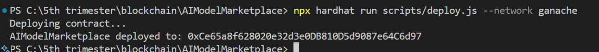
---

### **5. Connect MetaMask to Ganache**
1. Open MetaMask.
2. Add a custom RPC network:
   - **RPC URL**: `http://127.0.0.1:7545`
   - **Chain ID**: `1337` (or the one specified in Ganache).
   - **Currency Symbol**: `ETH`.

3. Import an account from Ganache into MetaMask:
   - Copy the private key from Ganache.
   - Import the account into MetaMask.
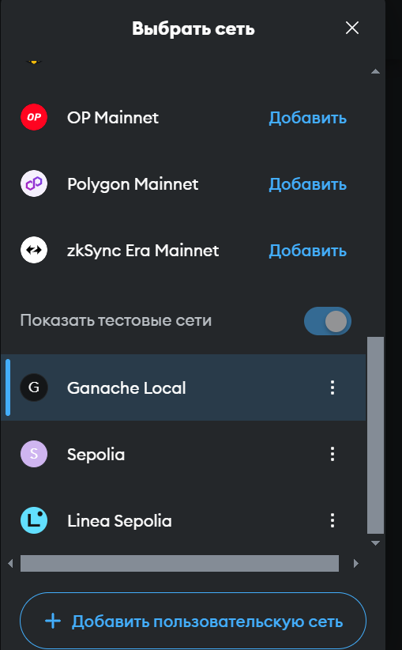

### **6. Test the Application Locally**
Run your frontend using:
```bash
npx live-server frontend/
```

Perform the following operations:
1. **List a Model**.
2. **Purchase a Model**.
3. **Rate a Model**.
4. **Get Model Details**.
5. **Withdraw Funds**.


## **Usage**

### **1. Start the Frontend**
Run a local server to host the frontend:
```bash
npx live-server frontend/
```

- **Frontend UI Loaded**: 
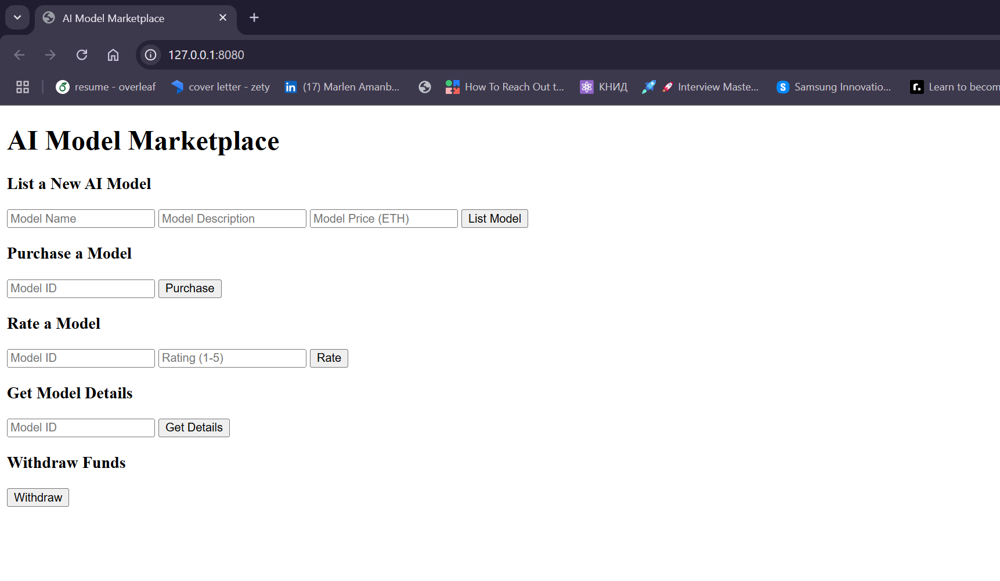

### **2. Interact with the dApp**

#### **a. List a New AI Model**
1. Fill in the **Model Name**, **Description**, and **Price (ETH)**.
2. Click the **"List Model"** button.
3. Confirm the transaction in MetaMask.

- **MetaMask Confirmation**: 
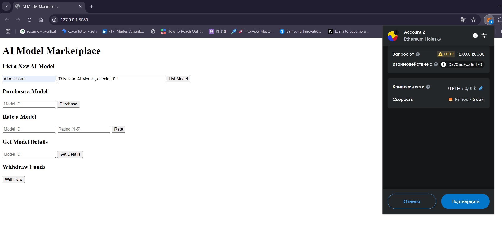
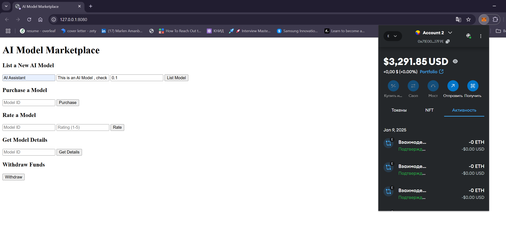
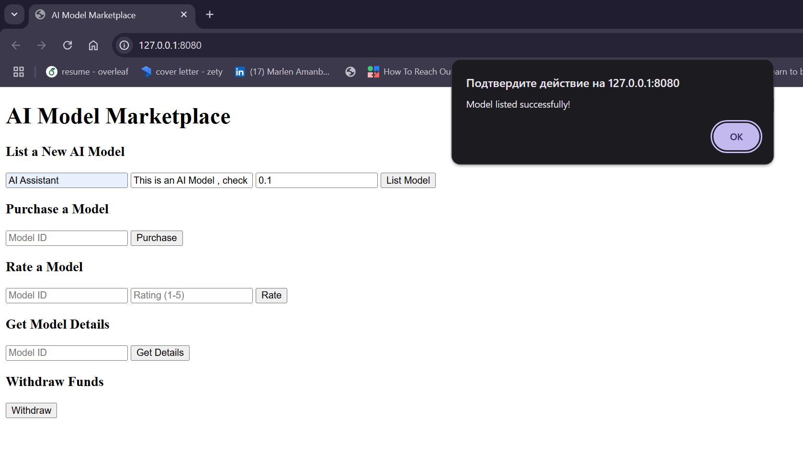

#### **b. Purchase an AI Model**
1. Enter the **Model ID** in the purchase section.
2. Click the **"Purchase"** button.
3. Confirm the transaction in MetaMask.

- **Purchase Success**: 


#### **c. Rate a Purchased Model**
1. Enter the **Model ID** and **Rating (1–5)** in the rating section.
2. Click the **"Rate"** button.
3. Confirm the transaction in MetaMask.

- **Rating Success**: 
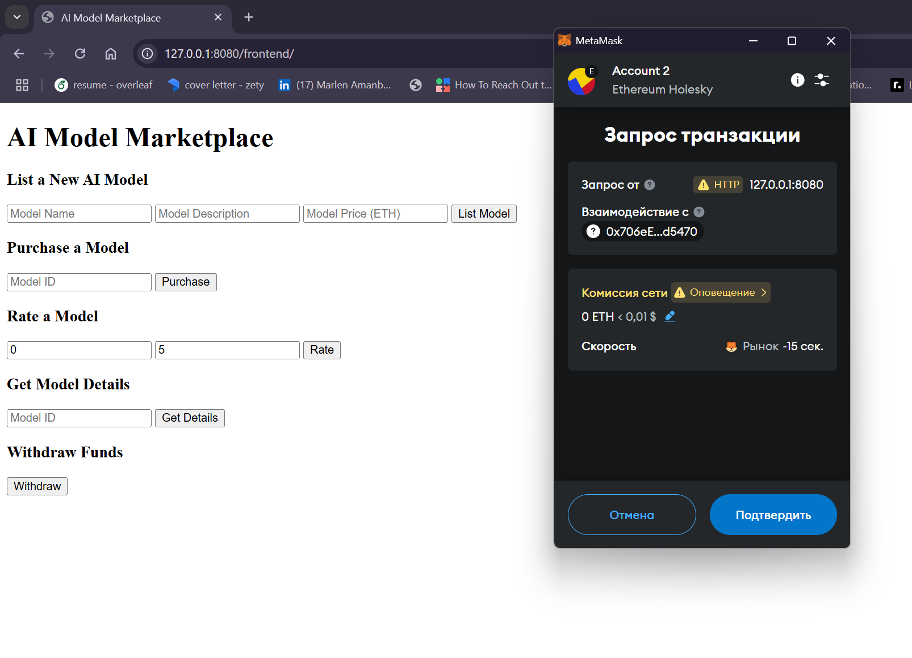
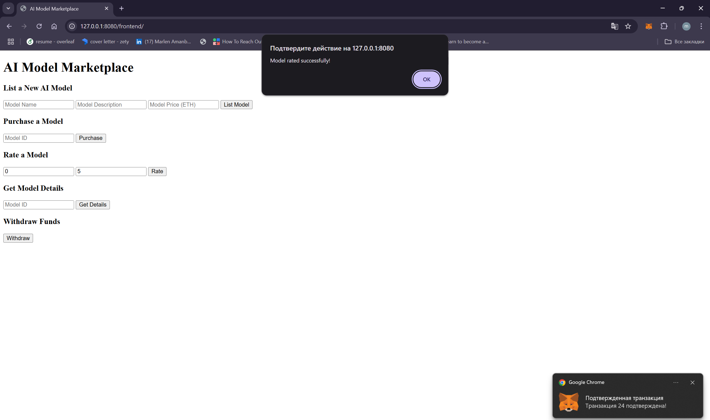

#### **d. Retrieve Model Details**
1. Enter the **Model ID** in the details section.
2. Click the **"Get Details"** button.

- **Model Details Displayed**:


#### **e. Withdraw Funds**
1. Click the **"Withdraw"** button in the withdrawal section.
2. Confirm the transaction in MetaMask.

- **Withdraw Success**: 
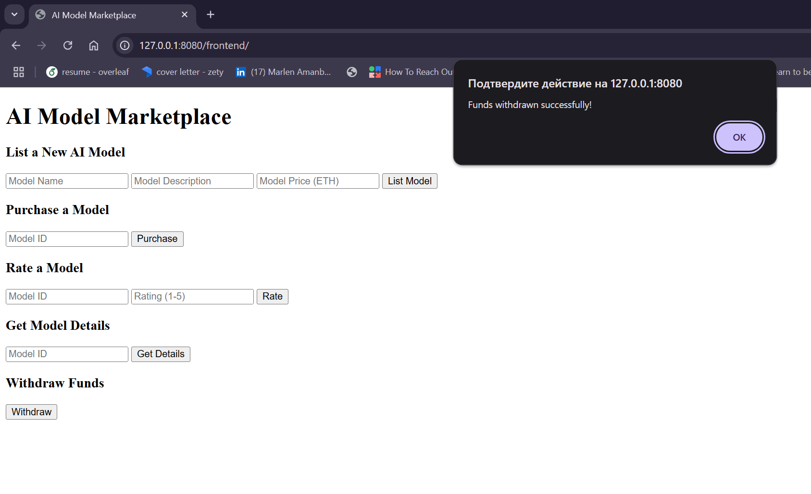

---

## **Demo Screenshots**

### **Deployment**
- 

### **Frontend UI**
- 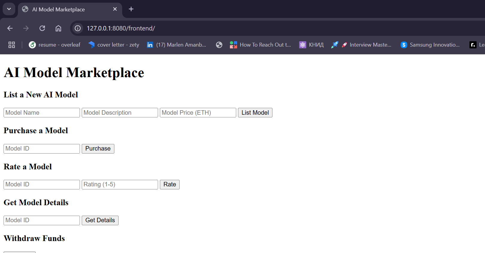

### **Features**
1. **List a Model**:
   - 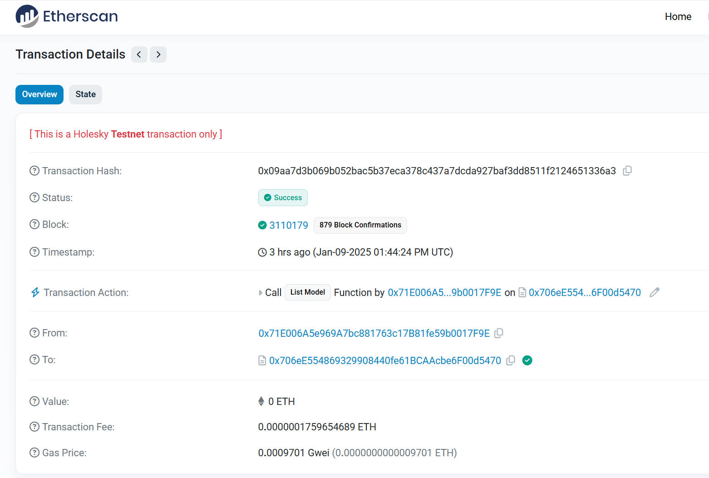
2. **Purchase a Model**:
   - 
3. **Rate a Model**:
   - 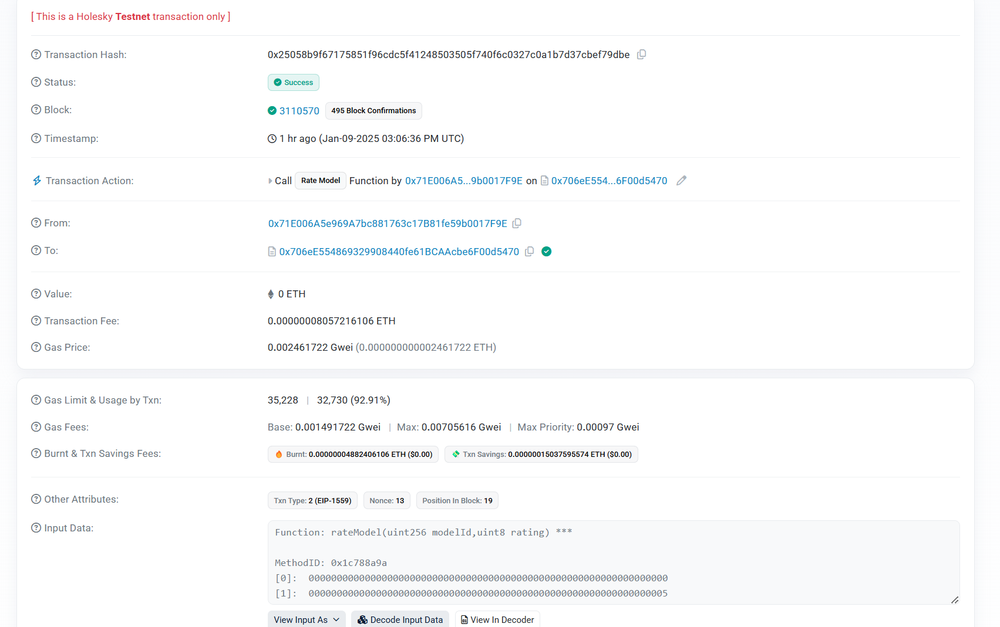
4. **Model Details**:
   - 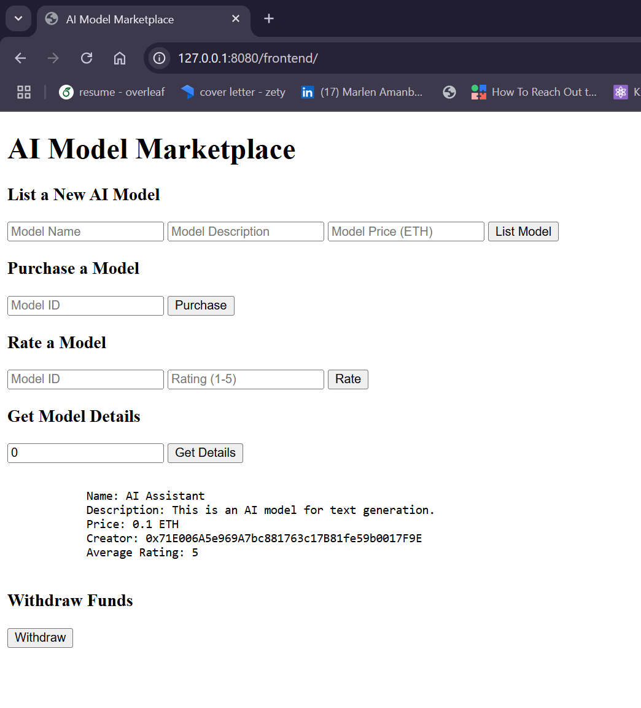
5. **Withdraw Funds**:
   - 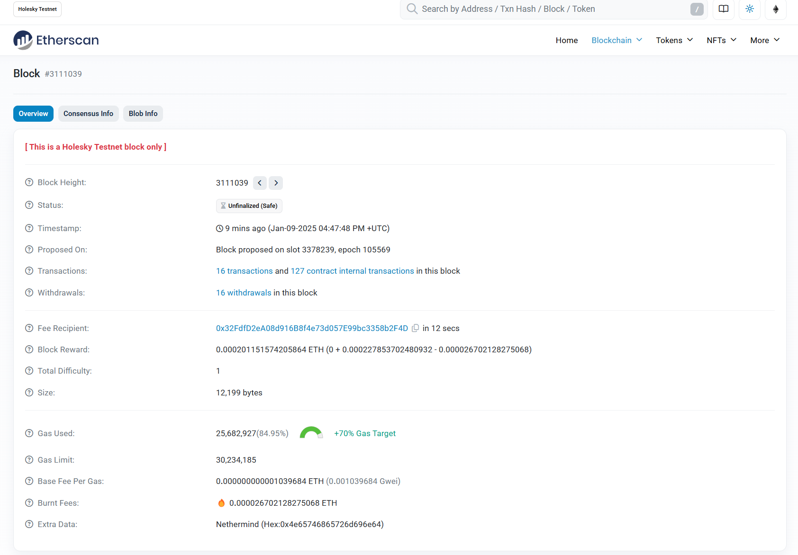

---

## **Examples**

Here’s an example of listing a model and viewing its details:

1. **List a Model**:
   - Model Name: `AI Text Generator`
   - Description: `A model for generating realistic text.`
   - Price: `0.1 ETH`

2. **Get Model Details**:
   ```
   Name: AI Text Generator
   Description: A model for generating realistic text.
   Price: 0.1 ETH
   Creator: 0x123...456
   Average Rating: 5
   ```

---

## **License**

This project is licensed under the [MIT License](LICENSE).
